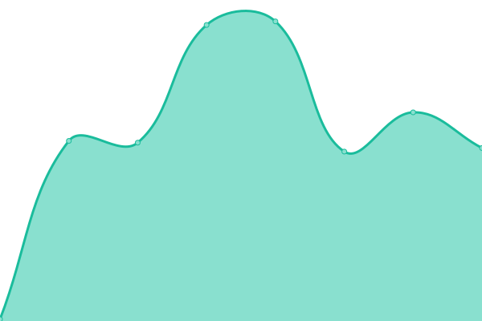

# [📈 Live Status](https://status.emailconnect.eu): <!--live status--> **🟩 All systems operational**

This repository contains the open-source uptime monitor and status page for [XADI](https://xadi.nl), powered by [Upptime](https://github.com/upptime/upptime).

With [Upptime](https://upptime.js.org), you can get your own unlimited and free uptime monitor and status page, powered entirely by a GitHub repository. We use [Issues](https://github.com/xadi-hq/emailconnect-status/issues) as incident reports, [Actions](https://github.com/xadi-hq/emailconnect-status/actions) as uptime monitors, and [Pages](https://status.emailconnect.eu) for the status page.

<!--start: status pages-->
<!-- This summary is generated by Upptime (https://github.com/upptime/upptime) -->
<!-- Do not edit this manually, your changes will be overwritten -->
<!-- prettier-ignore -->
| URL | Status | History | Response Time | Uptime |
| --- | ------ | ------- | ------------- | ------ |
|  [Web application & API](https://emailconnect.eu/health) | 🟩 Up | [web-application-and-api.yml](https://github.com/xadi-hq/emailconnect-status/commits/HEAD/history/web-application-and-api.yml) | 

 455ms
     
 | 

<a href="https://status.emailconnect.eu/history/web-application-and-api">97.84%</a>
    

|  [Postfix e-mail server](https://emailconnect.eu/health/postfix) | 🟩 Up | [postfix-e-mail-server.yml](https://github.com/xadi-hq/emailconnect-status/commits/HEAD/history/postfix-e-mail-server.yml) | 

 111ms
     
 | 

<a href="https://status.emailconnect.eu/history/postfix-e-mail-server">100.00%</a>
    

|  [mx1.emailconnect.eu](mx1.emailconnect.eu) | 🟩 Up | [mx1-emailconnect-eu.yml](https://github.com/xadi-hq/emailconnect-status/commits/HEAD/history/mx1-emailconnect-eu.yml) | 

 107ms
     
 | 

<a href="https://status.emailconnect.eu/history/mx1-emailconnect-eu">100.00%</a>
    

<!--end: status pages-->

[**Visit our status website →**](https://status.emailconnect.eu)

## 📄 License

- Powered by: [Upptime](https://github.com/upptime/upptime)
- Code: [MIT](./LICENSE) © [Anand Chowdhary](https://anandchowdhary.com), supported by [Pabio](https://pabio.com)
- Data in the `./history` directory: [Open Database License](https://opendatacommons.org/licenses/odbl/1-0/)
